# Super Admin Bus Management - API Flow Design

## 🎯 Tổng quan hệ thống

Hệ thống Super Admin Bus Management được thiết kế theo mô hình **multi-tenant** với các nhà xe (providers) khác nhau. Super Admin có quyền quản trị toàn bộ hệ thống, bao gồm:

- **Quản lý Providers**: Ban/Unban, set policies
- **Quản lý Dictionaries**: Categories, Seat Maps, Route Catalog
- **Workflow Approval**: Routes, Pricebooks, Promotions
- **Data Quality**: Alerts, Validation, Audit Trail
- **Bulk Operations**: Import/Export, Bulk Generate

## 📋 Luồng hoạt động chính

### 1. OVERVIEW DASHBOARD

#### 1.1 KPI Dashboard
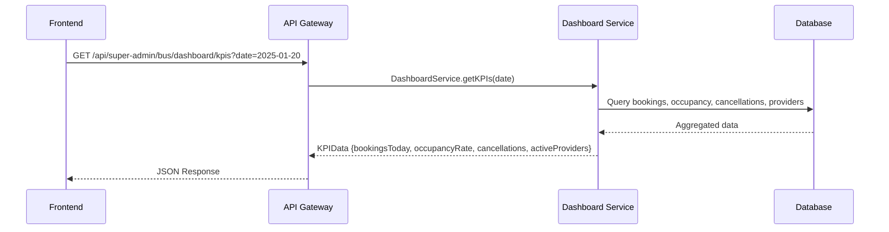

**API Endpoints:**
- `GET /api/super-admin/bus/dashboard/kpis?date=YYYY-MM-DD`
- `GET /api/super-admin/bus/dashboard/alerts?limit=50&query=string`

#### 1.2 Data Quality Alerts
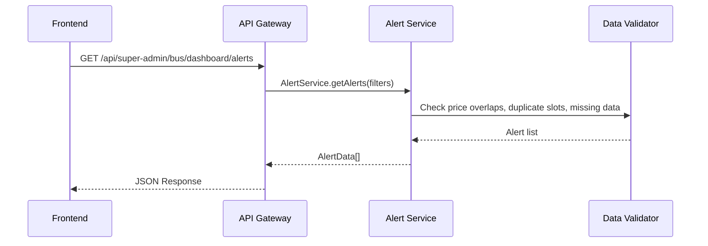

### 2. DICTIONARIES MANAGEMENT

#### 2.1 Bus Categories Flow
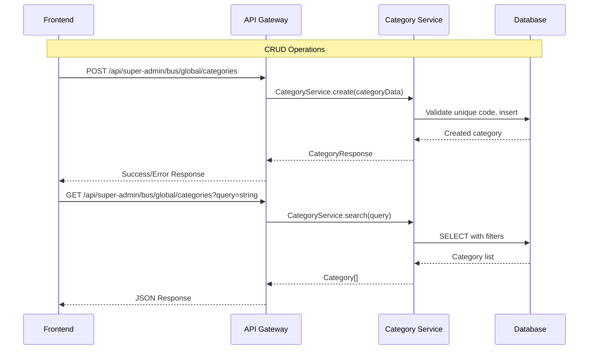

**API Endpoints:**
- `GET /api/super-admin/bus/global/categories?query=string`
- `POST /api/super-admin/bus/global/categories`
- `PUT /api/super-admin/bus/global/categories/{code}`
- `DELETE /api/super-admin/bus/global/categories/{code}`

#### 2.2 Seat Maps Flow
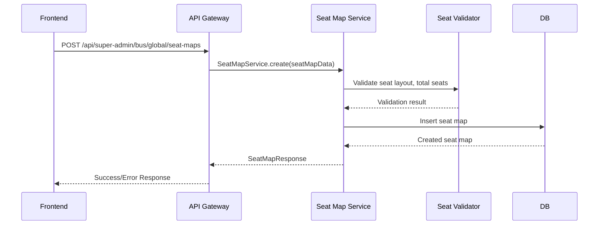

### 3. PROVIDERS MANAGEMENT

#### 3.1 Provider CRUD & Status Management
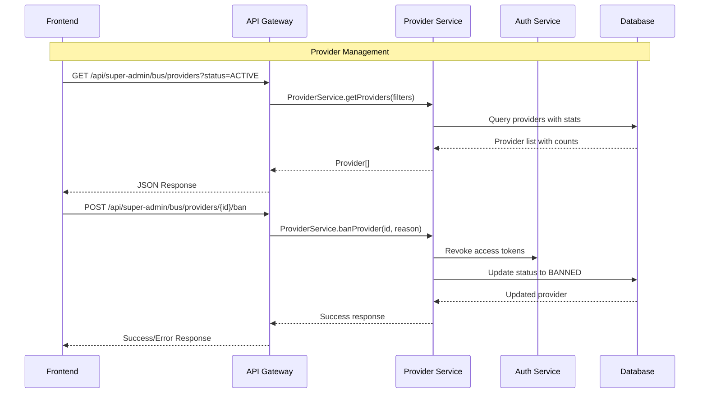

**API Endpoints:**
- `GET /api/super-admin/bus/providers?query=string&status=ACTIVE|BANNED`
- `POST /api/super-admin/bus/providers`
- `PUT /api/super-admin/bus/providers/{id}`
- `POST /api/super-admin/bus/providers/{id}/ban`
- `POST /api/super-admin/bus/providers/{id}/unban`

### 4. ROUTES MANAGEMENT (Workflow Approval)

#### 4.1 Route Creation & Approval Flow
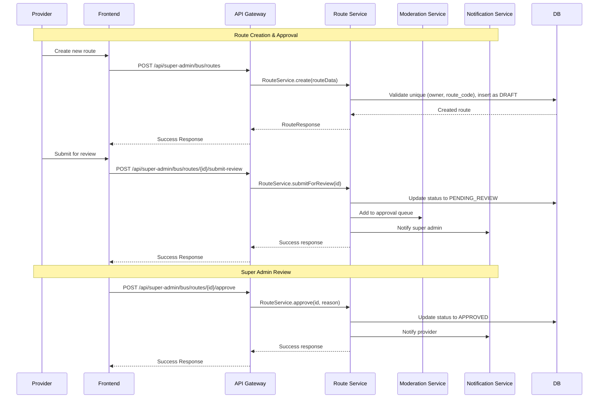

**API Endpoints:**
- `GET /api/super-admin/bus/routes?owner=string&origin=string&destination=string&status=DRAFT|PENDING_REVIEW|APPROVED|REJECTED|ARCHIVED`
- `POST /api/super-admin/bus/routes`
- `PUT /api/super-admin/bus/routes/{id}`
- `POST /api/super-admin/bus/routes/{id}/submit-review`
- `POST /api/super-admin/bus/routes/{id}/approve`
- `POST /api/super-admin/bus/routes/{id}/reject`

### 5. PRICEBOOKS MANAGEMENT

#### 5.1 Pricebook Creation & Approval Flow
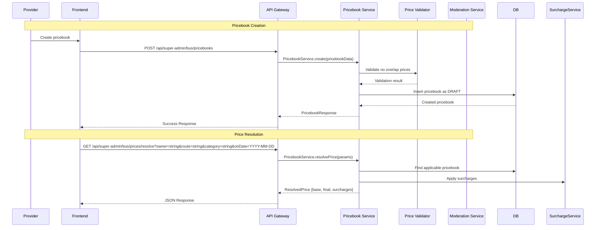

**API Endpoints:**
- `GET /api/super-admin/bus/pricebooks?owner=string&status=string&onDate=YYYY-MM-DD`
- `POST /api/super-admin/bus/pricebooks`
- `PUT /api/super-admin/bus/pricebooks/{id}`
- `POST /api/super-admin/bus/pricebooks/{id}/approve`
- `POST /api/super-admin/bus/pricebooks/{id}/reject`
- `GET /api/super-admin/bus/prices/resolve?owner=string&route=string&category=string&onDate=YYYY-MM-DD`

### 6. SLOTS MANAGEMENT

#### 6.1 Slot Creation & Bulk Generation
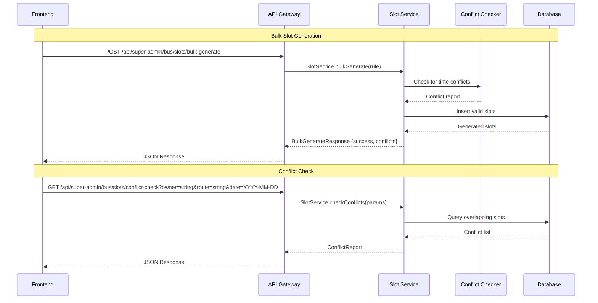

**API Endpoints:**
- `GET /api/super-admin/bus/slots?owner=string&route=string&date=YYYY-MM-DD`
- `POST /api/super-admin/bus/slots`
- `POST /api/super-admin/bus/slots/bulk-generate`
- `GET /api/super-admin/bus/slots/conflict-check`

### 7. MODERATION QUEUE

#### 7.1 Approval Queue Management
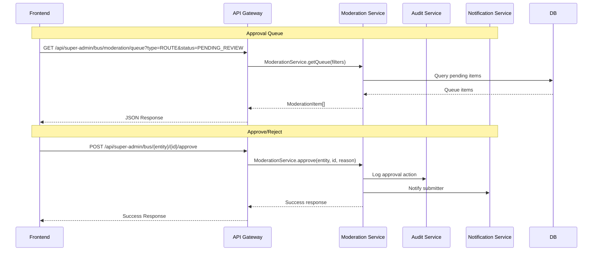

**API Endpoints:**
- `GET /api/super-admin/bus/moderation/queue?type=ROUTE|PRICEBOOK|PROMOTION&status=PENDING_REVIEW|APPROVED|REJECTED`
- `POST /api/super-admin/bus/{entity}/{id}/approve`
- `POST /api/super-admin/bus/{entity}/{id}/reject`

### 8. AUDIT TRAIL

#### 8.1 Audit Logging Flow
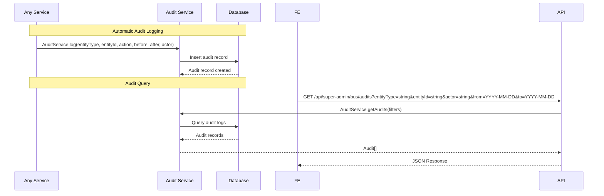

**API Endpoints:**
- `GET /api/super-admin/bus/audits?entityType=string&entityId=string&actor=string&from=YYYY-MM-DD&to=YYYY-MM-DD`

## 🔐 Security & Authorization

### Authentication Flow
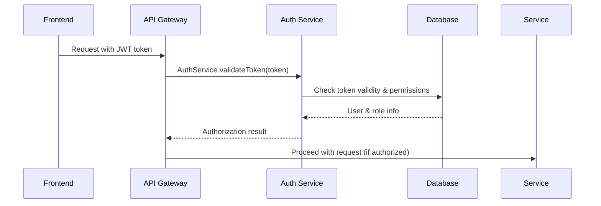

### Role-Based Access Control
- **SUPER_ADMIN**: Full access to all endpoints
- **PROVIDER_ADMIN**: Limited to own provider data
- **AUDITOR**: Read-only access to audit logs

## 📊 Data Models

### Core Entities
```typescript
interface Provider {
  id: number
  code: string
  name: string
  status: 'ACTIVE' | 'BANNED'
  createdAt: string
  updatedAt: string
}

interface Route {
  id: number
  ownerCode: string
  routeCode: string
  origin: string
  destination: string
  status: 'DRAFT' | 'PENDING_REVIEW' | 'APPROVED' | 'REJECTED' | 'ARCHIVED'
  submittedAt?: string
  approvedAt?: string
  approvedBy?: string
  rejectionReason?: string
}

interface Pricebook {
  id: number
  ownerCode: string
  name: string
  effectiveFrom: string
  effectiveTo: string
  status: 'DRAFT' | 'PENDING_REVIEW' | 'APPROVED' | 'REJECTED' | 'ARCHIVED'
  lines: PricebookLine[]
}

interface PricebookLine {
  id: number
  routeCode: string
  busCategoryCode: string
  basePrice: number
}

interface AuditLog {
  id: number
  entityType: string
  entityId: string
  action: string
  actor: string
  before?: any
  after?: any
  reason?: string
  createdAt: string
}
```

## 🚀 Implementation Priority

### Phase 1: Foundation (Week 1-2)
1. **Dictionaries APIs** (Categories, Seat Maps, Route Catalog)
2. **Providers APIs** (CRUD, Ban/Unban)
3. **Basic Auth & RBAC**

### Phase 2: Core Business (Week 3-4)
1. **Routes APIs** (CRUD + Approval Workflow)
2. **Buses APIs** (CRUD)
3. **Pricebooks APIs** (CRUD + Approval Workflow)

### Phase 3: Advanced Features (Week 5-6)
1. **Slots APIs** (CRUD + Bulk Generate)
2. **Moderation APIs** (Approval Queue)
3. **Audit APIs** (Logging & Query)

### Phase 4: Enhancement (Week 7-8)
1. **Overview Dashboard APIs**
2. **Import/Export APIs**
3. **Holidays & Surcharges APIs**
4. **Locks APIs**

## 🔧 Technical Considerations

### Database Design
- **Multi-tenant architecture** with owner-based partitioning
- **Soft deletes** for audit trail preservation
- **Indexes** on frequently queried fields (owner, status, dates)
- **Constraints** for data integrity (unique combinations, foreign keys)

### Performance Optimization
- **Pagination** for large datasets
- **Caching** for dictionary data
- **Async processing** for bulk operations
- **Database connection pooling**

### Error Handling
- **Consistent error responses** across all APIs
- **Validation errors** with field-level details
- **Business logic errors** with actionable messages
- **Audit logging** for all errors

### Monitoring & Observability
- **Request/Response logging**
- **Performance metrics** (response time, throughput)
- **Error rate monitoring**
- **Business metrics** (approval rates, conflict rates)

