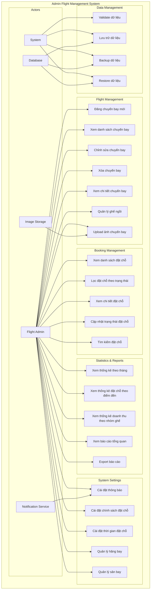

# Use Case Diagram cho Admin Flight System

## Use Case Diagram

## Chi tiết các Use Cases

### 1. Flight Management Use Cases

#### UC1: Đăng chuyến bay mới
- **Actor**: Flight Admin
- **Description**: Admin tạo chuyến bay mới với đầy đủ thông tin
- **Preconditions**: Admin đã đăng nhập
- **Main Flow**:
  1. Admin truy cập form đăng chuyến bay
  2. Nhập thông tin cơ bản (số hiệu, tên, thời gian)
  3. Chọn sân bay đi/đến
  4. Chọn hãng bay và danh mục
  5. Cấu hình thông tin vé (Economy/Business)
  6. Nhập giá vé và hành lý
  7. Upload ảnh chuyến bay
  8. Validate form
  9. Lưu chuyến bay vào database
  10. Tạo FlightSlots theo cấu hình
  11. Hiển thị thông báo thành công

#### UC2: Xem danh sách chuyến bay
- **Actor**: Flight Admin
- **Description**: Admin xem danh sách tất cả chuyến bay với phân trang và lọc
- **Main Flow**:
  1. Admin truy cập trang danh sách
  2. Hệ thống load danh sách chuyến bay
  3. Hiển thị thông tin: số hiệu, tuyến bay, thời gian, trạng thái
  4. Admin có thể tìm kiếm, lọc theo tháng/năm
  5. Phân trang kết quả

#### UC3: Chỉnh sửa chuyến bay
- **Actor**: Flight Admin
- **Description**: Admin chỉnh sửa thông tin chuyến bay
- **Main Flow**:
  1. Admin chọn chuyến bay cần sửa
  2. Load thông tin chuyến bay vào form
  3. Admin chỉnh sửa thông tin
  4. Validate dữ liệu
  5. Cập nhật database
  6. Hiển thị thông báo thành công

#### UC4: Xóa chuyến bay
- **Actor**: Flight Admin
- **Description**: Admin xóa chuyến bay khỏi hệ thống
- **Main Flow**:
  1. Admin chọn chuyến bay cần xóa
  2. Hiển thị dialog xác nhận
  3. Admin xác nhận xóa
  4. Kiểm tra ràng buộc (có đặt chỗ chưa)
  5. Xóa chuyến bay khỏi database
  6. Hiển thị thông báo thành công

#### UC5: Xem chi tiết chuyến bay
- **Actor**: Flight Admin
- **Description**: Admin xem thông tin chi tiết chuyến bay
- **Main Flow**:
  1. Admin chọn chuyến bay
  2. Load thông tin chi tiết
  3. Hiển thị thông tin: flight, slots, bookings, images
  4. Admin có thể chỉnh sửa ghế ngồi
  5. Admin có thể upload thêm ảnh

#### UC6: Quản lý ghế ngồi
- **Actor**: Flight Admin
- **Description**: Admin quản lý thông tin ghế ngồi của chuyến bay
- **Main Flow**:
  1. Admin xem danh sách ghế
  2. Chỉnh sửa thông tin ghế (giá, loại, trạng thái)
  3. Thêm/xóa ghế
  4. Cập nhật trạng thái ghế
  5. Lưu thay đổi vào database

#### UC7: Upload ảnh chuyến bay
- **Actor**: Flight Admin
- **Description**: Admin upload ảnh cho chuyến bay
- **Main Flow**:
  1. Admin chọn file ảnh
  2. Upload lên Image Storage Service
  3. Lưu thông tin ảnh vào database
  4. Hiển thị ảnh đã upload
  5. Admin có thể xóa ảnh

### 2. Booking Management Use Cases

#### UC8: Xem danh sách đặt chỗ
- **Actor**: Flight Admin
- **Description**: Admin xem danh sách tất cả đặt chỗ
- **Main Flow**:
  1. Admin truy cập trang quản lý đặt chỗ
  2. Load danh sách bookings từ database
  3. Hiển thị thông tin: ID, customer, flight, trạng thái
  4. Phân trang kết quả

#### UC9: Lọc đặt chỗ theo trạng thái
- **Actor**: Flight Admin
- **Description**: Admin lọc đặt chỗ theo trạng thái
- **Main Flow**:
  1. Admin chọn trạng thái cần lọc
  2. Hệ thống filter bookings theo trạng thái
  3. Hiển thị kết quả đã lọc

#### UC10: Xem chi tiết đặt chỗ
- **Actor**: Flight Admin
- **Description**: Admin xem thông tin chi tiết đặt chỗ
- **Main Flow**:
  1. Admin chọn booking cần xem
  2. Load thông tin chi tiết booking
  3. Hiển thị thông tin: customer, flight, payment, status

#### UC11: Cập nhật trạng thái đặt chỗ
- **Actor**: Flight Admin
- **Description**: Admin cập nhật trạng thái đặt chỗ
- **Main Flow**:
  1. Admin chọn booking cần cập nhật
  2. Chọn trạng thái mới
  3. Cập nhật database
  4. Gửi notification cho customer

#### UC12: Tìm kiếm đặt chỗ
- **Actor**: Flight Admin
- **Description**: Admin tìm kiếm đặt chỗ theo tiêu chí
- **Main Flow**:
  1. Admin nhập từ khóa tìm kiếm
  2. Hệ thống search trong database
  3. Hiển thị kết quả tìm kiếm

### 3. Statistics & Reports Use Cases

#### UC13: Xem thống kê theo tháng
- **Actor**: Flight Admin
- **Description**: Admin xem thống kê chuyến bay theo tháng
- **Main Flow**:
  1. Admin chọn năm/tháng
  2. Hệ thống tính toán thống kê
  3. Hiển thị: tổng chuyến bay, đặt chỗ, doanh thu
  4. So sánh với tháng trước

#### UC14: Xem thống kê đặt chỗ theo điểm đến
- **Actor**: Flight Admin
- **Description**: Admin xem thống kê đặt chỗ theo điểm đến
- **Main Flow**:
  1. Admin chọn năm/tháng
  2. Hệ thống tính toán theo destination
  3. Hiển thị biểu đồ cột
  4. Hiển thị top destinations

#### UC15: Xem thống kê doanh thu theo nhóm ghế
- **Actor**: Flight Admin
- **Description**: Admin xem thống kê doanh thu theo loại ghế
- **Main Flow**:
  1. Admin chọn năm/tháng
  2. Hệ thống tính toán theo seat class
  3. Hiển thị biểu đồ tròn
  4. Hiển thị tỷ lệ doanh thu

#### UC16: Xem báo cáo tổng quan
- **Actor**: Flight Admin
- **Description**: Admin xem báo cáo tổng quan hệ thống
- **Main Flow**:
  1. Admin truy cập dashboard
  2. Hệ thống load dữ liệu tổng quan
  3. Hiển thị các metrics chính
  4. Hiển thị biểu đồ trends

#### UC17: Export báo cáo
- **Actor**: Flight Admin
- **Description**: Admin export báo cáo ra file
- **Main Flow**:
  1. Admin chọn loại báo cáo
  2. Chọn định dạng file (PDF/Excel)
  3. Hệ thống generate báo cáo
  4. Download file

### 4. System Settings Use Cases

#### UC18: Cài đặt thông báo
- **Actor**: Flight Admin
- **Description**: Admin cấu hình thông báo hệ thống
- **Main Flow**:
  1. Admin truy cập trang cài đặt
  2. Cấu hình email notifications
  3. Cấu hình SMS notifications
  4. Lưu cài đặt

#### UC19: Cài đặt chính sách đặt chỗ
- **Actor**: Flight Admin
- **Description**: Admin cấu hình chính sách đặt chỗ
- **Main Flow**:
  1. Admin chọn chính sách hủy chuyến bay
  2. Cấu hình thời gian đặt chỗ trước
  3. Cấu hình cho phép chọn ghế
  4. Lưu cài đặt

#### UC20: Cài đặt thời gian đặt chỗ
- **Actor**: Flight Admin
- **Description**: Admin cấu hình thời gian đặt chỗ
- **Main Flow**:
  1. Admin nhập số giờ tối thiểu trước chuyến bay
  2. Cấu hình thời gian đóng đặt chỗ
  3. Lưu cài đặt

#### UC21: Quản lý hãng bay
- **Actor**: Flight Admin
- **Description**: Admin quản lý danh sách hãng bay
- **Main Flow**:
  1. Admin xem danh sách hãng bay
  2. Thêm hãng bay mới
  3. Chỉnh sửa thông tin hãng bay
  4. Xóa hãng bay

#### UC22: Quản lý sân bay
- **Actor**: Flight Admin
- **Description**: Admin quản lý danh sách sân bay
- **Main Flow**:
  1. Admin xem danh sách sân bay
  2. Thêm sân bay mới
  3. Chỉnh sửa thông tin sân bay
  4. Xóa sân bay

### 5. Data Management Use Cases

#### UC23: Validate dữ liệu
- **Actor**: System
- **Description**: Hệ thống validate dữ liệu trước khi lưu
- **Main Flow**:
  1. Kiểm tra format dữ liệu
  2. Validate business rules
  3. Trả về kết quả validation

#### UC24: Lưu trữ dữ liệu
- **Actor**: System
- **Description**: Hệ thống lưu trữ dữ liệu vào database
- **Main Flow**:
  1. Chuẩn bị dữ liệu
  2. Lưu vào database
  3. Xác nhận lưu thành công

#### UC25: Backup dữ liệu
- **Actor**: System
- **Description**: Hệ thống backup dữ liệu
- **Main Flow**:
  1. Tạo backup file
  2. Lưu vào storage
  3. Ghi log backup

#### UC26: Restore dữ liệu
- **Actor**: System
- **Description**: Hệ thống restore dữ liệu từ backup
- **Main Flow**:
  1. Chọn backup file
  2. Restore dữ liệu
  3. Xác nhận restore thành công

## Relationships

### Include Relationships
- UC1 includes UC23 (Validate dữ liệu)
- UC3 includes UC23
- UC6 includes UC24 (Lưu trữ dữ liệu)
- UC7 includes UC24
- UC11 includes UC24

### Extend Relationships
- UC2 extends UC23 (Validate search criteria)
- UC8 extends UC23 (Validate filter criteria)
- UC13 extends UC23 (Validate date range)

### Generalization
- UC21 and UC22 are specializations of general "Data Management" use case
- UC13, UC14, UC15 are specializations of general "Statistics" use case
