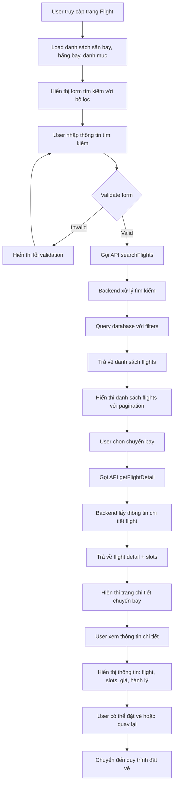
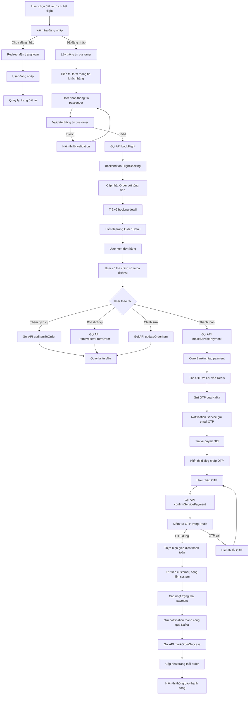

# Sơ đồ Activity Diagram cho Flight System

## CN1: Hiển thị danh sách theo bộ lọc -> Xem chi tiết chuyến bay



## CN2: Đặt vé từ chi tiết -> Thanh toán OTP



## CN3: Quy trình thêm chuyến bay (Admin)

```mermaid
flowchart TD
    A[Admin truy cập trang quản lý flight] --> B[Load danh sách flights hiện có]
    B --> C[Admin click "Thêm chuyến bay mới"]
    C --> D[Hiển thị form tạo flight]
    D --> E[Load danh sách airports, airlines, categories]
    E --> F[Admin nhập thông tin cơ bản]
    F --> G[Admin chọn sân bay đi/đến]
    G --> H[Admin nhập thời gian bay]
    H --> I[Admin chọn hãng bay và danh mục]
    I --> J[Admin nhập thông tin vé]
    J --> K[Admin cấu hình số lượng ghế Economy/Business]
    K --> L[Admin nhập giá vé từng loại]
    L --> M[Admin cấu hình hành lý xách tay]
    M --> N[Admin upload ảnh chuyến bay]
    N --> O[Validate form]
    O -->|Invalid| P[Hiển thị lỗi validation]
    P --> F
    O -->|Valid| Q[Gọi API createFlightWithDetails]
    Q --> R[Backend tạo Flight entity]
    R --> S[Tạo FlightSlots theo cấu hình]
    S --> T[Lưu thông tin flight vào database]
    T --> U[Trả về flight created]
    U --> V[Upload images nếu có]
    V --> W[Gọi API uploadFlightImages]
    W --> X[Image Storage Service upload ảnh]
    X --> Y[Lưu thông tin ảnh vào database]
    Y --> Z[Hiển thị thông báo thành công]
    Z --> AA[Redirect về trang danh sách flights]
    AA --> BB[Admin có thể xem, chỉnh sửa, xóa flight]
```

## Chi tiết các thành phần chính:

### Backend Services:
- **FlightService**: Xử lý tìm kiếm và hiển thị flights
- **FlightBookingService**: Xử lý đặt vé và thanh toán
- **AdminFlightService**: Quản lý CRUD flights cho admin
- **PaymentService**: Xử lý thanh toán qua core banking
- **NotificationService**: Gửi email OTP qua Kafka

### Frontend Components:
- **FlightHome.vue**: Trang tìm kiếm và hiển thị flights
- **FlightDetail.vue**: Chi tiết chuyến bay
- **OrderDetail.vue**: Quản lý đơn hàng và thanh toán
- **formAdminFlight.vue**: Form tạo/chỉnh sửa flight cho admin

### Database Entities:
- **Flight**: Thông tin chuyến bay
- **FlightSlot**: Thông tin ghế và giá
- **FlightBooking**: Đặt vé
- **Order**: Đơn hàng tổng hợp
- **Customer**: Thông tin khách hàng

### External Services:
- **Core Banking Service**: Xử lý thanh toán và OTP
- **Redis**: Lưu trữ OTP tạm thời
- **Kafka**: Message queue cho notifications
- **Notification Service**: Gửi email OTP
