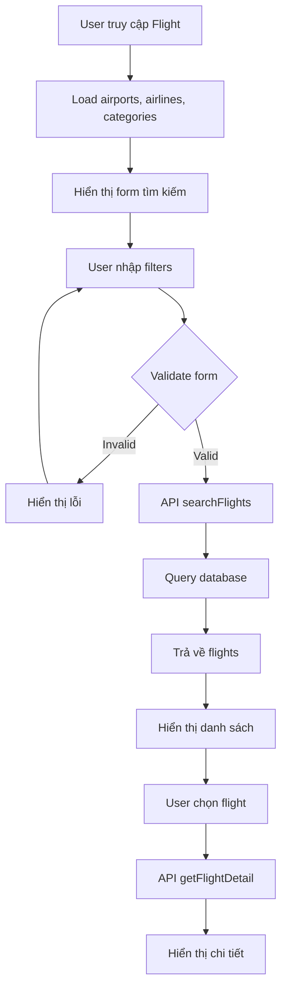
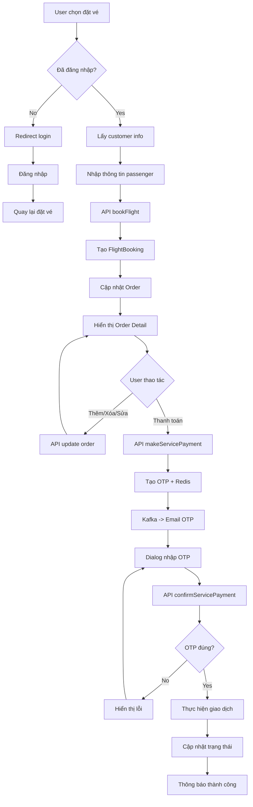
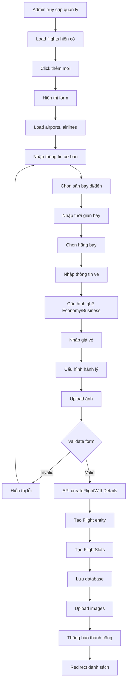

# Flight Activity Diagrams

## CN1: Tìm kiếm và xem chi tiết chuyến bay

```mermaid
flowchart TD
    A[User truy cập Flight] --> B[Load airports, airlines, categories]
    B --> C[Hiển thị form tìm kiếm]
    C --> D[User nhập filters]
    D --> E{Validate form}
    E -->|Invalid| F[Hiển thị lỗi]
    F --> D
    E -->|Valid| G[API searchFlights]
    G --> H[Query database]
    H --> I[Trả về flights]
    I --> J[Hiển thị danh sách]
    J --> K[User chọn flight]
    K --> L[API getFlightDetail]
    L --> M[Hiển thị chi tiết]
```

## CN2: Đặt vé và thanh toán OTP

```mermaid
flowchart TD
    A[User chọn đặt vé] --> B{Đã đăng nhập?}
    B -->|No| C[Redirect login]
    C --> D[Đăng nhập]
    D --> E[Quay lại đặt vé]
    B -->|Yes| F[Lấy customer info]
    F --> G[Nhập thông tin passenger]
    G --> H[API bookFlight]
    H --> I[Tạo FlightBooking]
    I --> J[Cập nhật Order]
    J --> K[Hiển thị Order Detail]
    K --> L{User thao tác}
    L -->|Thêm/Xóa/Sửa| M[API update order]
    M --> K
    L -->|Thanh toán| N[API makeServicePayment]
    N --> O[Tạo OTP + Redis]
    O --> P[Kafka -> Email OTP]
    P --> Q[Dialog nhập OTP]
    Q --> R[API confirmServicePayment]
    R --> S{OTP đúng?}
    S -->|No| T[Hiển thị lỗi]
    T --> Q
    S -->|Yes| U[Thực hiện giao dịch]
    U --> V[Cập nhật trạng thái]
    V --> W[Thông báo thành công]
```

## CN3: Admin thêm chuyến bay

```mermaid
flowchart TD
    A[Admin truy cập quản lý] --> B[Load flights hiện có]
    B --> C[Click thêm mới]
    C --> D[Hiển thị form]
    D --> E[Load airports, airlines]
    E --> F[Nhập thông tin cơ bản]
    F --> G[Chọn sân bay đi/đến]
    G --> H[Nhập thời gian bay]
    H --> I[Chọn hãng bay]
    I --> J[Nhập thông tin vé]
    J --> K[Cấu hình ghế Economy/Business]
    K --> L[Nhập giá vé]
    L --> M[Cấu hình hành lý]
    M --> N[Upload ảnh]
    N --> O{Validate form}
    O -->|Invalid| P[Hiển thị lỗi]
    P --> F
    O -->|Valid| Q[API createFlightWithDetails]
    Q --> R[Tạo Flight entity]
    R --> S[Tạo FlightSlots]
    S --> T[Lưu database]
    T --> U[Upload images]
    U --> V[Thông báo thành công]
    V --> W[Redirect danh sách]
```
