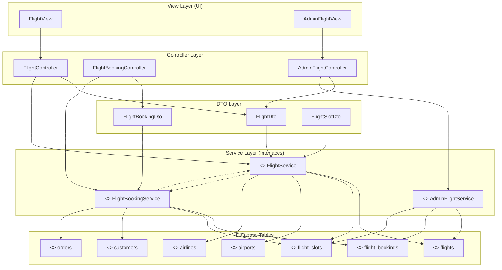
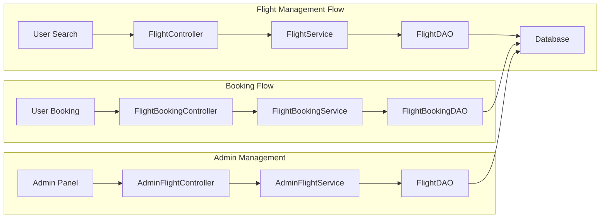
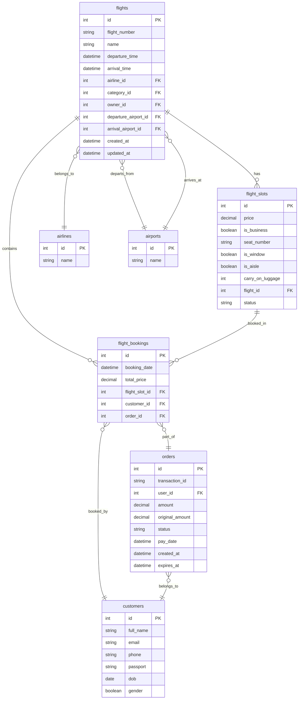

# Flight System Architecture Diagram

## System Architecture Overview



## Detailed Component Relationships



## Database Schema Relationships



## API Endpoints Structure

```mermaid
graph TD
    subgraph "Public Flight APIs"
        A1[POST /api/flights/search]
        A2[GET /api/flights/{id}]
        A3[GET /api/flights/{id}/available-seats]
        A4[POST /api/flights/find-available-slot]
        A5[GET /api/flights/airlines]
    end
    
    subgraph "Flight Booking APIs"
        B1[POST /api/bookings/flights]
        B2[GET /api/bookings/flights/{id}]
        B3[PUT /api/bookings/flights/{id}/cancel]
    end
    
    subgraph "Admin Flight APIs"
        C1[GET /api/admin/flights]
        C2[POST /api/admin/flights]
        C3[PUT /api/admin/flights/{id}]
        C4[DELETE /api/admin/flights/{id}]
        C5[GET /api/admin/flights/{id}/seats]
        C6[PUT /api/admin/flights/{id}/seats]
    end
    
    A1 --> FC[FlightController]
    A2 --> FC
    A3 --> FC
    A4 --> FC
    A5 --> FC
    
    B1 --> FBC[FlightBookingController]
    B2 --> FBC
    B3 --> FBC
    
    C1 --> AFC[AdminFlightController]
    C2 --> AFC
    C3 --> AFC
    C4 --> AFC
    C5 --> AFC
    C6 --> AFC
```

## Service Layer Methods

```mermaid
graph TD
    subgraph "FlightService Interface"
        FS1[searchFlights]
        FS2[getFlightDetail]
        FS3[getAvailableSeats]
        FS4[getAllFlights]
        FS5[findFirstAvailableSlot]
    end
    
    subgraph "FlightBookingService Interface"
        FBS1[bookFlight]
        FBS2[payForFlight]
        FBS3[getCustomerFlightBookings]
        FBS4[cancelFlightBooking]
    end
    
    subgraph "AdminFlightService Interface"
        AFS1[getFlights]
        AFS2[createFlight]
        AFS3[updateFlight]
        AFS4[deleteFlight]
        AFS5[getFlightStatistics]
    end
    
    FS1 --> FS[FlightService]
    FS2 --> FS
    FS3 --> FS
    FS4 --> FS
    FS5 --> FS
    
    FBS1 --> FBS[FlightBookingService]
    FBS2 --> FBS
    FBS3 --> FBS
    FBS4 --> FBS
    
    AFS1 --> AFS[AdminFlightService]
    AFS2 --> AFS
    AFS3 --> AFS
    AFS4 --> AFS
    AFS5 --> AFS
```



## Key Features and Capabilities

- **Flight Search & Filtering**: Tìm kiếm chuyến bay theo điểm đi, điểm đến, ngày bay
- **Seat Management**: Quản lý ghế ngồi với các loại khác nhau (Economy, Business)
- **Real-time Availability**: Kiểm tra ghế còn trống theo thời gian thực
- **Booking System**: Hệ thống đặt vé với thanh toán tích hợp
- **Admin Dashboard**: Giao diện quản trị toàn diện cho admin
- **Statistics & Reporting**: Thống kê chuyến bay, doanh thu, hiệu suất
- **Image Management**: Quản lý hình ảnh chuyến bay
- **Customer Management**: Quản lý thông tin khách hàng và lịch sử đặt vé
- **Payment Integration**: Tích hợp nhiều phương thức thanh toán
- **Order Management**: Quản lý đơn hàng và trạng thái thanh toán
